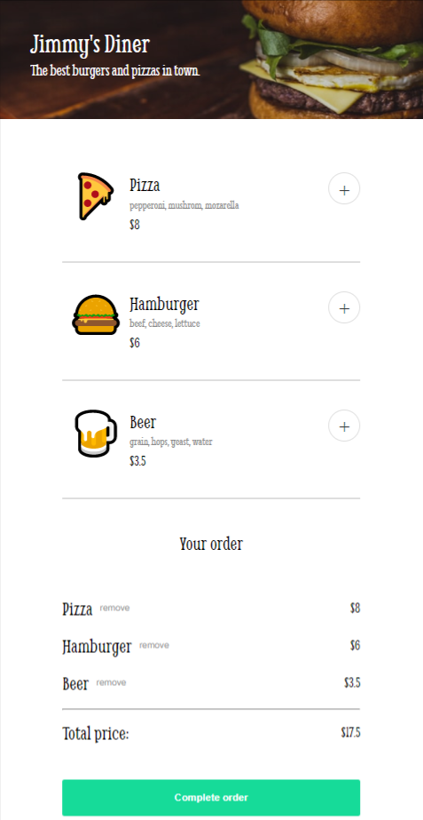
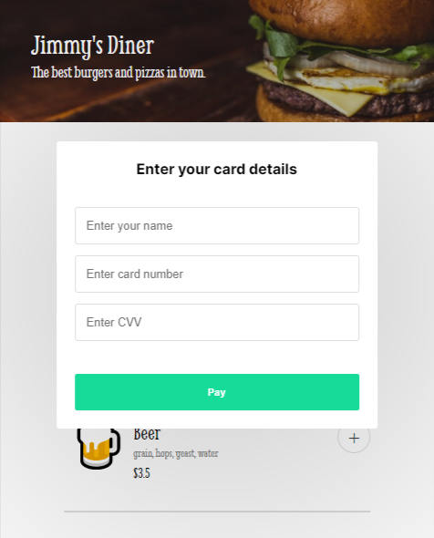

# Restaurant ordering website

This is the solo project from the Essential JavaScript concepts course on the coding course platform [Scrimba](https://scrimba.com/learn/frontend).

## Link

- [Project url](https://restaurant-ordering-app-scrimba.netlify.app/) (hosted on Netlify)

## Screenshots

 

## Project

Users should be able to:

- Add and remove items to/from the cart
- See the current total of their cart
- Fill in a form to pay for the item
- See a personalised message with their name after submitting the form

I used Webpack to bundle the files.

## Built with

- Semantic HTML5 markup
- CSS custom properties and media queries
- JavaScript
- Sass
- Webpack

## Author

Chiara Stefanelli - Front-End Development Student based in Italy

- Website - [Chiara Stefanelli](https://chiarastefanelli.netlify.app/)
- LinkedIn - [Chiara Stefanelli](https://www.linkedin.com/in/chiarastefanelli/?locale=en_US)
